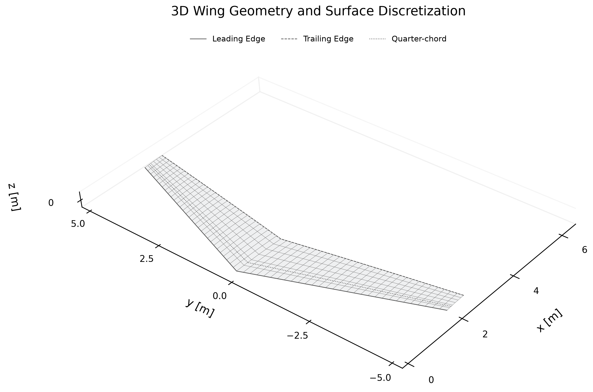
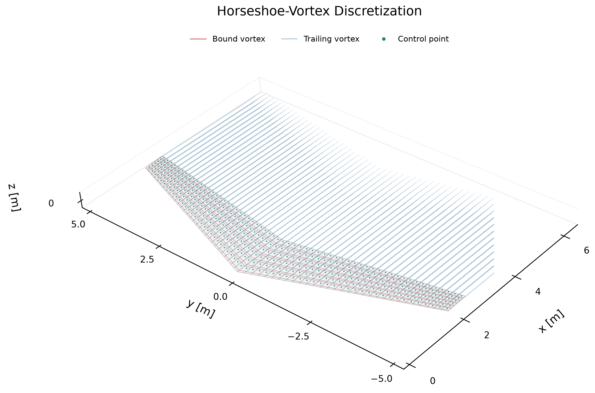
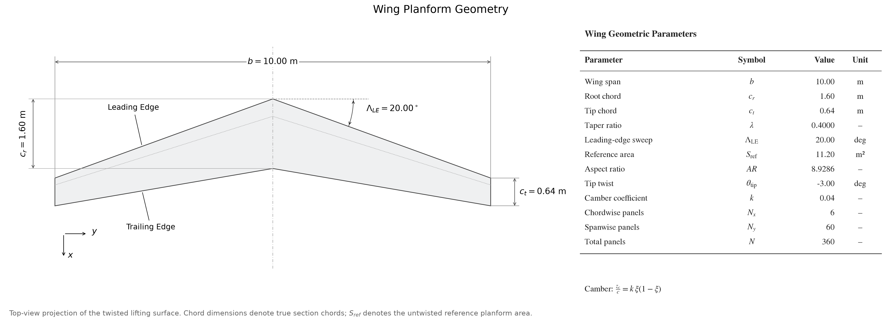

# Three-Dimensional Vortex Lattice Method for Finite Wings

## Abstract

A three-dimensional steady incompressible Vortex Lattice Method is implemented for finite wings with sweep, taper, geometric twist, and camber. The mean lifting surface is discretized into quadrilateral panels, each associated with a horseshoe vortex and a collocation point. Circulation is obtained by enforcing the no-penetration boundary condition using finite-segment Biot–Savart velocities and geometric panel normals. The resulting dense linear system is solved directly, and the circulation field is post-processed to obtain spanwise loading, total lift, trailing-vortex downwash, induced angle, and near-field induced-drag quantities. Numerical verification covers vortex-kernel behavior, geometry transformations, normal orientation, matrix assembly, and load integration. Lift-curve slopes are validated against published Bertin and Campbell VLM reference cases reported by McBain. A separate rectangular-wing study examines spanwise mesh convergence at fixed chordwise resolution. These comparisons establish consistency for the tested cases without implying experimental validation or general validation of induced drag for twisted and cambered configurations.

## Mathematical Formulation

### Horseshoe-vortex representation

Each panel carries a horseshoe vortex consisting of a bound segment and two straight trailing legs. For an oriented finite segment from $A$ to $B$, define

$$
\mathbf{r}_1 = P - A,\qquad
\mathbf{r}_2 = P - B,\qquad
\mathbf{r}_0 = B - A.
$$

The induced velocity at $P$ is

$$
\mathbf{v}(P)
=
\frac{\Gamma}{4\pi}\,
\frac{\mathbf{r}_1 \times \mathbf{r}_2}
     {\left\lVert \mathbf{r}_1 \times \mathbf{r}_2 \right\rVert^2}
\left[
\mathbf{r}_0 \cdot
\left(
\frac{\mathbf{r}_1}{\lVert \mathbf{r}_1 \rVert}
-
\frac{\mathbf{r}_2}{\lVert \mathbf{r}_2 \rVert}
\right)
\right].
$$

The horseshoe follows $A_{\mathrm{far}}\rightarrow A\rightarrow B\rightarrow B_{\mathrm{far}}$, with both far endpoints displaced along global $+x$. Segment velocities are superposed; no far-wake closing segment is included.

### Boundary condition

At control point $i$, the no-penetration condition is

$$
\left(\mathbf{V}_\infty + \mathbf{V}_{\mathrm{ind},i}\right)
\cdot \mathbf{n}_i = 0.
$$

Writing the induced velocity as a sum over source horseshoes gives

$$
\mathbf{A}\boldsymbol{\Gamma} = \mathbf{b},
$$

$$
A_{ij} = \mathbf{n}_i \cdot \mathbf{v}_{ij},
\qquad
b_i = -\mathbf{V}_\infty \cdot \mathbf{n}_i.
$$

Here $\mathbf{v}_{ij}$ is the velocity induced at control point $i$ by **unit-strength** source horseshoe $j$. The freestream convention is $\mathbf{V}_\infty = V_\infty[\cos\alpha,\,0,\,\sin\alpha]$.

### Aerodynamic post-processing

For the panel-grid quantities below, $i$ denotes chordwise row and $j$ denotes spanwise panel. Spanwise circulation is the sum of all chordwise horseshoe strengths:

$$
\Gamma_{\mathrm{span},j}
=
\sum_{i=0}^{N_x-1}\Gamma_{ij},
\qquad
L'_j = \rho V_\infty\,\Gamma_{\mathrm{span},j}.
$$

The implemented Kutta–Joukowski lift sum is

$$
L
=
\rho V_\infty
\sum_{i,j}\Gamma_{ij}\,\Delta y_{ij},
\qquad
\Delta y_{ij} = \left|B_{y,ij}-A_{y,ij}\right|.
$$

The width is the spanwise projection, not the three-dimensional bound-segment length. For shared spanwise strips, the equivalent integral is $L=\sum_j L'_j\Delta y_j$. With $q_\infty=\tfrac{1}{2}\rho V_\infty^2$,

$$
C_L = \frac{L}{q_\infty S_{\mathrm{ref}}}.
$$

Trailing-only downwash is the global vertical component of the velocity induced by all trailing legs:

$$
w_{ij}
=
\mathbf{e}_z\cdot
\sum_{m,n}\Gamma_{mn}\,
\mathbf{v}^{\,\mathrm{trailing},\,\mathrm{unit}}_{ij,mn}.
$$

Downward velocity is negative. The small-angle induced incidence, in radians, is

$$
\alpha_i = -\frac{w}{V_\infty}.
$$

Here the subscript on $\alpha_i$ denotes induced incidence, not a panel index. The near-field induced-drag calculation is

$$
D_i
=
-\rho\sum_{i,j}w_{ij}\,\Gamma_{ij}\,\Delta y_{ij},
$$

$$
C_{D_i} = \frac{D_i}{q_\infty S_{\mathrm{ref}}},
\qquad
e = \frac{C_L^2}{\pi\,AR\,C_{D_i}},
\qquad
AR = \frac{b^2}{S_{\mathrm{ref}}}.
$$

Near-field induced drag and span efficiency have not been independently validated for arbitrary multiple-chordwise-row twisted/cambered configurations. No Trefftz-plane calculation is implemented, and the calculated efficiency is not capped at one.

## Numerical Implementation

Uniform spanwise stations and local chord fractions define the quadrilateral mesh. Bound endpoints lie at one-quarter of each local **panel chord**, and collocation points lie at three-quarters, evaluated at the spanwise panel midpoint. Endpoints and control points are sampled on the transformed mean surface.

Panel normals are normalized cross products of averaged opposite chordwise and spanwise edges, corresponding to the bilinear quadrilateral's center tangents. Twisted quadrilaterals can be nonplanar; their normals are geometric approximations rather than analytical camber-line normals.

Finite-segment velocities populate a dense influence matrix, followed by a direct linear solve. Panel-grid indexing is C-order, $k=iN_y+j$. For reproducibility, the segment evaluation returns zero when $\lVert\mathbf{r}_1\times\mathbf{r}_2\rVert^2<10^{-12}$.

The boundary condition includes the **full horseshoe-induced velocity**, projected onto each receiving panel's normal. Downwash post-processing includes **trailing-leg velocity only**, retaining its global $z$ component. The prescribed finite wake extends along $+x$ and is not aligned iteratively with the local induced flow.

## Wing Geometry and Discretization

<table>
  <tr>
    <td width="50%"></td>
    <td width="50%"></td>
  </tr>
  <tr>
    <td><em>(a) Three-dimensional lifting-surface geometry and panel discretization</em></td>
    <td><em>(b) Horseshoe-vortex lattice, control points, and prescribed wake</em></td>
  </tr>
  <tr>
    <td colspan="2"></td>
  </tr>
  <tr>
    <td colspan="2"><em>(c) Engineering planform definition and geometric parameters</em></td>
  </tr>
</table>

The configuration combines linear taper, leading-edge sweep, linear spanwise twist about the local leading edge, and camber $z_c/c=0.04\xi(1-\xi)$. Coordinates are downstream $x$, spanwise $y$, and upward $z$. The $N_x=6$, $N_y=60$ mesh has 360 circulation unknowns and preserves the transformed surface geometry. The planform is its actual top projection; section chords and reference area refer to the untwisted defining planform. The lattice image shows the first 4 m of the 100 m prescribed trailing legs, without changing the aerodynamic wake length.

## Verification

Verification proceeded from the vortex kernel through geometric transformation, surface-normal construction, influence-matrix assembly, and linear-system solution. Finite-segment Biot–Savart velocities were checked against known analytical evaluations, linear circulation scaling, and orientation reversal. Geometric transformations recovered the corresponding simpler configurations when sweep, taper variation, twist, or camber was removed. Independent reconstruction of twisted and cambered section coordinates checked the applied rotation and preservation of camber sign. Panel normals were reconstructed from corner geometry and compared with the unit normals used in the aerodynamic system.

Influence coefficients were compared independently with direct induced-velocity evaluations, and the generalized normal-projection formulation was checked against the flat-wing formulation in their common limiting case. The linear solution was checked against known systems and through the circulation residual

$$
\mathbf{r}
=
\mathbf{A}\boldsymbol{\Gamma}
-
\mathbf{b}.
$$

Together with the independent coefficient comparisons, a small residual verifies consistency of matrix assembly and linear solution; it does not by itself establish aerodynamic accuracy. Mirror symmetry, panel ordering, local chord lengths, and zero-circulation and geometric limiting cases were used to expose indexing and sign errors.

Post-processing verification compared lift summation and spanwise load integration with hand-calculated quantities, trailing-vortex downwash with directly reconstructed trailing-leg velocities, and induced-angle signs and simple induced-drag arithmetic with independent evaluations. These checks establish numerical consistency of the evaluated quantities. The near-field induced-drag formulation has not been independently validated for arbitrary multiple-chordwise-row twisted/cambered geometries.

## Validation

External aerodynamic validation was performed by independently reproducing published finite-wing VLM lift-curve-slope cases reported in McBain's *Theory of Lift*. The comparisons use a small-angle right-hand side, $b_i=-V_\infty\alpha$, at $\alpha=1^\circ$, with $C_{L\alpha}=C_L/\alpha$.

| Case | $N_x \times N_y$ | Reference $C_{L\alpha}$ [rad⁻¹] | Present VLM $C_{L\alpha}$ [rad⁻¹] | Relative error [%] |
|---|---:|---:|---:|---:|
| Bertin | 1 × 8 | 3.4442 | 3.444340096961 | 0.00406762 |
| Bertin | 2 × 8 | 3.4389 | 3.439012803310 | 0.00328021 |
| Bertin | 3 × 8 | 3.4369 | 3.437012939029 | 0.00328607 |
| Campbell | 1 × 20 | 3.5633 | 3.563329522962 | 0.00082853 |

The reproduced lift-curve slopes differ from the published reference values by 0.00082853–0.00406762%, depending on the case and discretization; the reference values are supplied to four decimal places. These comparisons validate the implemented horseshoe-VLM formulation for the reproduced finite-wing lift-slope cases. They do not constitute experimental validation of the final swept, tapered, twisted, and cambered configuration or independent validation of the general multirow near-field induced-drag formulation.

Bertin uses $AR=5$, unit taper ratio, and $45^\circ$ sweep. Campbell uses $AR=6$, taper ratio 0.6, and $45^\circ$ quarter-chord sweep, converted to leading-edge sweep. All cases retain a finite wake length of 100 units. Relative error is defined by

$$
\varepsilon_{\mathrm{rel}}
=
100\,
\frac{\left|C_{L\alpha}-C_{L\alpha,\mathrm{ref}}\right|}
     {\left|C_{L\alpha,\mathrm{ref}}\right|}.
$$

The separate NACA RM A50A23 geometry preview uses simplified linear twist and zero camber and is not a quantitative validation case.

## Aerodynamic Results

The finite-wing calculation uses $\rho=1.225\ \mathrm{kg/m^3}$, $V_\infty=30\ \mathrm{m/s}$, $\alpha=5^\circ$, and the 100 m prescribed wake. Spanwise circulation and lift are obtained directly from the solved $6\times60$ circulation field.

The distributions use 60 actual panel-centered spanwise stations and the chordwise sum of all six rows. No artificial tip points are added, no curves are fitted, and no symmetry is imposed in post-processing. The solution is symmetric, with maximum loading toward the central region and decreasing loading toward the tips. The outermost stations do not coincide with the geometric tips; their nonzero circulation is retained. At the stated density and speed, $L'_j=36.75\,\Gamma_{\mathrm{span},j}$ in SI units, so both distributions have the same spanwise dependence.

Trailing-only downwash and induced angle are additionally evaluated at the last chordwise row's control points using all source horseshoes. Local downwash is neither summed nor averaged across chordwise receiving rows.

## Numerical Convergence

A separate flat rectangular-wing study varies only $N_y$, with $N_x=1$ fixed. Conditions are span 2 m, chord 1 m, $\alpha=5^\circ$, $\rho=1\ \mathrm{kg/m^3}$, $V_\infty=1\ \mathrm{m/s}$, and wake length 100 m.

| $N_y$ | Total panels | $C_L$ | Relative difference from $N_y=128$ [%] |
|---:|---:|---:|---:|
| 4 | 4 | 0.252912133690 | 18.85991417 |
| 8 | 8 | 0.232817394625 | 9.41608510 |
| 16 | 16 | 0.222266987043 | 4.45776016 |
| 32 | 32 | 0.216875285830 | 1.92384795 |
| 64 | 64 | 0.214150932093 | 0.64349637 |
| 128 | 128 | 0.212781689652 | 0.00000000 |

Relative differences are $100\,|C_L-C_{L,128}|/|C_{L,128}|$. The change between the two finest meshes is

$$
\left|C_{L,128}-C_{L,64}\right|
=
1.369242441365\times10^{-3}.
$$

The $N_y=128$ solution is a numerical reference, not an exact solution. The study establishes spanwise refinement behavior at fixed chordwise resolution; it does not establish mesh independence for the $N_x=6$, $N_y=60$ twisted/cambered configuration. Near-field drag, span efficiency, and linear-system residuals are also evaluated in the refinement study.

## Model Scope and Limitations

The applicable regime is steady, attached, incompressible, inviscid lifting-surface aerodynamics. The thin mean-surface representation excludes viscous boundary layers, separation, stall, shocks/transonic effects, and profile drag. The finite prescribed straight wake does not undergo free-wake evolution or roll-up.

The dense influence matrix, geometric panel-normal approximation, and finite-segment cutoff are numerical characteristics of the implementation. Discretization and wake-length sensitivity remain relevant even when the algebraic residual is small. Near-field induced drag and derived span efficiency require further independent validation for general multiple-chordwise-row twisted/cambered configurations. Structural loads and bending moments are not calculated.

## References

1. G. D. McBain, *Theory of Lift: Introductory Computational Aerodynamics in MATLAB/Octave*, John Wiley & Sons, 2012.
   DOI: [10.1002/9781118346167](https://doi.org/10.1002/9781118346167).
